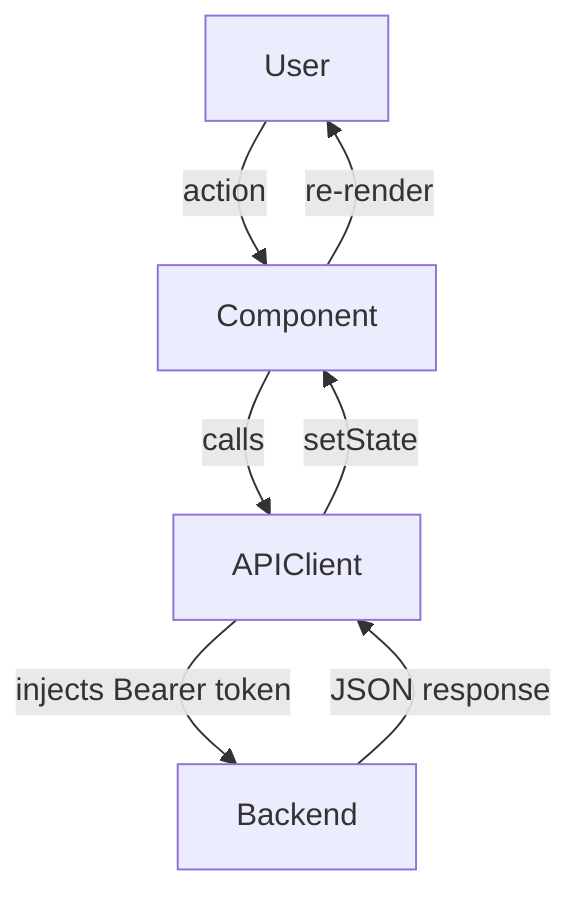
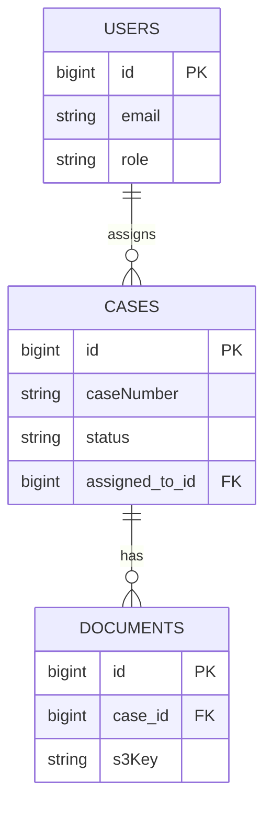
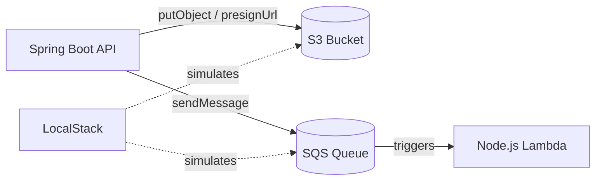
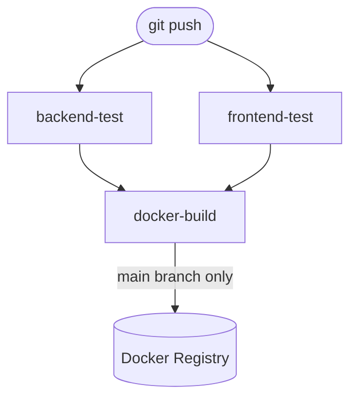
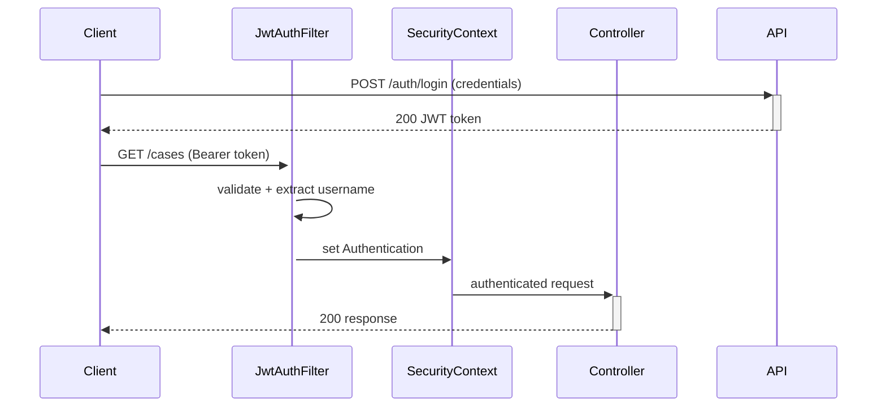

You are my senior technical interview coach.

My JD-based practice project has already been built in this workspace.

Your task:
Inspect the current workspace and generate clear interview talking points based on the actual project files.

Do not ask me to manually paste the JD, project summary, implemented features, or tech stack unless they cannot be found from the workspace.

First inspect relevant files such as:
- docs/*-plan.md (search for any file matching this pattern — e.g. `algorithm-validation-engine-plan.md`, `transit-alert-dashboard-plan.md`)
- README.md
- project plan files
- job description files
- backend source code
- frontend source code
- package.json
- pom.xml
- build.gradle
- Dockerfile
- docker-compose.yml
- GitHub Actions workflows
- Jenkinsfile
- Terraform or deployment files
- test files
- configuration files

Use the docs/*-plan.md file as the main source of truth if it exists. If multiple plan files are found, prefer the one that matches the project folder name or the most recently modified one.

Infer:
- what the project does
- the backend stack
- the frontend stack
- the database
- cloud services or simulated cloud services
- CI/CD setup
- testing setup
- security features
- main business features
- how this project maps to the target job description

If the original job description or JD analysis is available in docs/*-plan.md, use it directly.

If no docs/*-plan.md file exists, inspect the workspace and clearly say:

"I could not find a docs/*-plan.md file, so this explanation is based on the project implementation found in the workspace."

Output this:

# 1. Project Summary
Give me a short 30-second explanation of the project.

Make it sound natural, like something I can say in a real interview.

# 2. Actual Tech Stack Found
Create a table:

| Area | Technology Found | Evidence From Workspace | Interview Explanation |
|---|---|---|---|

# 3. Main Features Implemented
Create a table:

| Feature | Files / Modules Involved | Skill Demonstrated | How To Explain It |
|---|---|---|---|

# 4. JD Skill Mapping
For each JD skill (or likely interview skill if no JD is available), output a subsection using this exact structure:

---

### {Skill Name}

#### JD Skill
{skill name or "Likely Interview Skill: {name}" if no JD}

#### What I Built
{one or two sentences describing what was implemented}

#### Example Code
```{language}
{5–15 lines copied exactly from the workspace files}
```

#### How To Explain It
"{a concise, confident talking point ready for an interview}"

---

Repeat this structure for every skill. Separate each skill block with `---`.

Rules for **Example Code**:
- Copy the snippet exactly from the actual workspace files — do not invent or paraphrase.
- Use a fenced code block with the correct language tag (e.g. `java`, `typescript`, `sql`, `yaml`, `javascript`).
- Pick the single most representative snippet for each skill — the one that best shows the concept at a glance.
- Prefer real implementation code over config or boilerplate (e.g. the method body over the import block).
- If no single snippet captures the skill, combine two short fragments with a `// ...` separator.
- If the skill is process-based (Agile, AI tools), write `*(process — no code snippet)*` instead of a code block.

# 5. Backend Talking Points
First, output a Mermaid diagram showing the backend request flow. Use a `flowchart TD` showing the path from HTTP request → Controller → Service → Repository → Database, and any async side-effects (e.g. SQS, S3). Label each arrow with the key action (e.g. `validate`, `query`, `putObject`).

Example shape to follow (adapt to the actual project):
```mermaid
flowchart TD
    Client -->|HTTP Request| Controller
    Controller -->|calls| Service
    Service -->|JPA query| Repository
    Repository -->|SQL| Database
    Service -.->|@Async| SQS
```

Then, for each topic below, output a subsection using this structure:

### {Topic Name}

**How It Works:**
{one or two sentences explaining the implementation}

**Example Code:**
```{language}
{5–15 lines copied exactly from the workspace files, or omit this block if no relevant code exists}
```

**How To Explain It:**
"{a concise, interview-ready talking point}"

Topics to cover:
- API design
- Business logic
- Validation
- Database access
- Error handling
- Performance considerations
- Trade-offs made for simplicity

# 6. Frontend Talking Points
First, output a Mermaid diagram showing the frontend data flow. Use a `flowchart TD` showing the path from user interaction → React component → Axios/API client → Backend, and the return path back through state updates to the UI. Include the JWT interceptor if present.

Example shape to follow (adapt to the actual project):


Then, for each topic below, output a subsection using this structure:

### {Topic Name}

**How It Works:**
{one or two sentences explaining the implementation}

**Example Code:**
```{language}
{5–15 lines copied exactly from the workspace files, or omit this block if no relevant code exists}
```

**How To Explain It:**
"{a concise, interview-ready talking point}"

Topics to cover:
- UI structure
- State management
- API integration
- User experience
- Trade-offs made for simplicity

# 7. Database Talking Points
First, output a Mermaid entity-relationship diagram showing the database schema. Use `erDiagram` to show all tables, their key columns, and the relationships between them (one-to-many, many-to-one, etc.).

Example shape to follow (adapt to the actual project):


Then, for each topic below, output a subsection using this structure:

### {Topic Name}

**How It Works:**
{one or two sentences explaining the implementation}

**Example Code:**
```{language}
{5–15 lines copied exactly from the workspace files, or omit this block if no relevant code exists}
```

**How To Explain It:**
"{a concise, interview-ready talking point}"

Topics to cover:
- Schema design
- Relationships
- Queries
- Indexing
- Trade-offs
- What I would improve for production

# 8. Cloud Talking Points
First, output a Mermaid diagram showing how the cloud services are connected. Use a `flowchart LR` showing the application components and the AWS services they interact with (S3, SQS, Lambda, etc.), including LocalStack as the local simulation layer if applicable.

Example shape to follow (adapt to the actual project):


Then, for each topic below, output a subsection using this structure:

### {Topic Name}

**How It Works:**
{one or two sentences explaining the implementation}

**Example Code:**
```{language}
{5–15 lines copied exactly from the workspace files, or omit this block if no relevant code exists}
```

**How To Explain It:**
"{a concise, interview-ready talking point}"

Topics to cover:
- Which cloud services are used or simulated
- Why those services make sense
- How this maps to the target JD
- What I would improve for production deployment

# 9. CI/CD Talking Points
First, output a Mermaid diagram showing the CI/CD pipeline flow. Use a `flowchart TD` showing the trigger, each job, the dependencies between jobs, and any branch conditions (e.g. `if: main only`).

Example shape to follow (adapt to the actual project):


Then, for each topic below, output a subsection using this structure:

### {Topic Name}

**How It Works:**
{one or two sentences explaining the implementation}

**Example Code:**
```{language}
{5–15 lines copied exactly from the workspace files, or omit this block if no relevant code exists}
```

**How To Explain It:**
"{a concise, interview-ready talking point}"

Topics to cover:
- Build
- Test
- Docker image
- Deployment
- Rollback or safety checks
- What the pipeline demonstrates for interview purposes

# 10. Testing Talking Points
For each topic below, output a subsection using this structure:

### {Topic Name}

**How It Works:**
{one or two sentences explaining the implementation}

**Example Code:**
```{language}
{5–15 lines copied exactly from the workspace files, or omit this block if no relevant code exists}
```

**How To Explain It:**
"{a concise, interview-ready talking point}"

Topics to cover:
- Unit tests
- Integration tests
- Frontend tests
- What risks the tests cover
- What additional tests I would add in production

# 11. Security Talking Points
First, output a Mermaid sequence diagram showing the authentication and authorization flow. Use `sequenceDiagram` to show the login flow (client → API → JWT issuance) and a subsequent protected request (client → JWT filter → security context → controller).

Example shape to follow (adapt to the actual project):


Then, for each topic below, output a subsection using this structure:

### {Topic Name}

**How It Works:**
{one or two sentences explaining the implementation}

**Example Code:**
```{language}
{5–15 lines copied exactly from the workspace files, or omit this block if no relevant code exists}
```

**How To Explain It:**
"{a concise, interview-ready talking point}"

Topics to cover:
- Authentication
- Authorization
- Input validation
- Secrets management
- CORS or API security
- Production improvements

# 12. System Design Explanation
Give me a clear architecture walkthrough I can say out loud.

Include:
- user flow
- frontend flow
- backend flow
- database flow
- cloud or async flow
- deployment flow
- bottlenecks
- scalability improvements

# 13. Behavioral Story
Create a realistic STAR-style story based on this practice project.

Important:
- Keep it honest.
- Do not pretend this was a production project.
- Frame it as a hands-on interview preparation project or portfolio project.
- Do not exaggerate business impact.

Use this format:
- Situation
- Task
- Action
- Result

# 14. Mock Interview Questions
Generate interviewer questions about this project.

**Coverage rule:** Every JD skill listed in Section 4 must be covered by at least one question. After writing the questions, cross-check each skill from Section 4 and add extra questions for any that are uncovered — do not stop at 10 if more are needed.

For each question, include:
- Strong sample answer (grounded in actual workspace code)
- What the interviewer is really testing
- A short follow-up question they might ask

# 15. 60-Second Final Pitch
Give me a confident 60-second project pitch that connects the project back to the JD.

Make it sound natural, practical, and interview-ready.

# 16. Weak Areas / Gaps
Based on the actual workspace, identify any missing or weak areas.

Create this table:

| Gap | Why It Matters | How To Explain It Honestly | How To Improve It |
|---|---|---|---|

# 17. Final Interview Cheat Sheet
Create a concise cheat sheet I can quickly review before an interview.

Include:
- 5 strongest talking points
- 5 technical terms to mention
- 5 trade-offs to explain
- 5 likely follow-up questions
- 5 concise answers

Important rules:
- Base the answer on the actual workspace files.
- Do not invent features that are not implemented.
- Clearly separate implemented features from future production improvements.
- Keep the answers natural and interview-friendly.
- Tie answers back to the JD when the JD is available.
- Focus on practical trade-offs and real engineering decisions.
- If important context is missing, say what is missing and make the best reasonable inference.
- Do not modify source code unless I explicitly ask you to.
- Do not create new application files.
- You may create or update docs/interview-talking-points.md with the final generated talking points.

# Input / Context

Here is the current project workspace path:

${input}

Use this path as the main project folder to inspect.

If `${input}` is empty or unclear, ask me to provide the specific project path under the `projects/` folder before continuing.

Inspect the project files under that path, especially:
- docs/*-plan.md (e.g. `algorithm-validation-engine-plan.md`)
- README.md
- backend/
- frontend/
- package.json
- pom.xml
- build.gradle
- Dockerfile
- docker-compose.yml
- .github/workflows/
- Jenkinsfile
- Terraform or deployment files
- test files
- configuration files

Do not require me to paste the JD, project summary, tech stack, or implemented features manually unless they cannot be found from the project folder.
