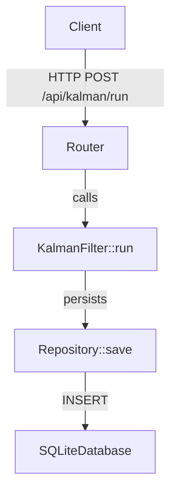
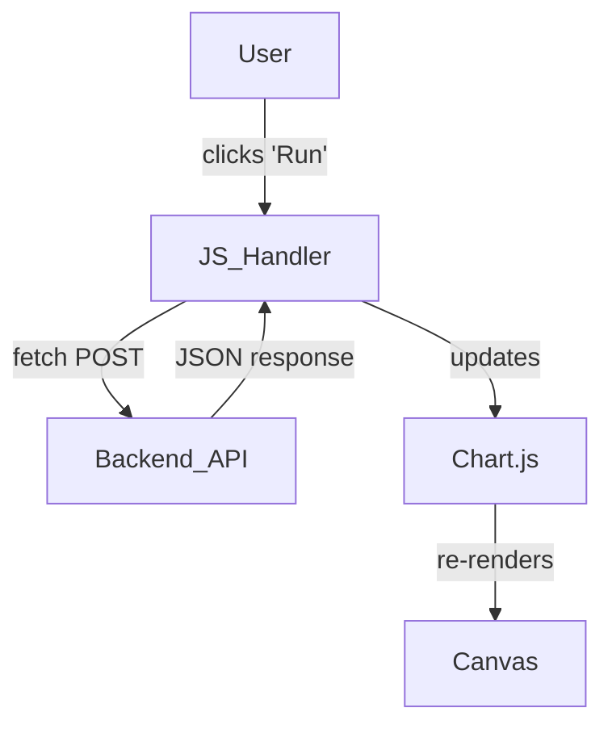
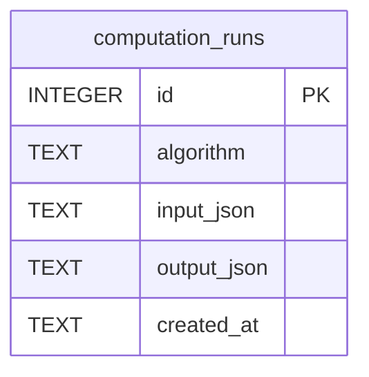
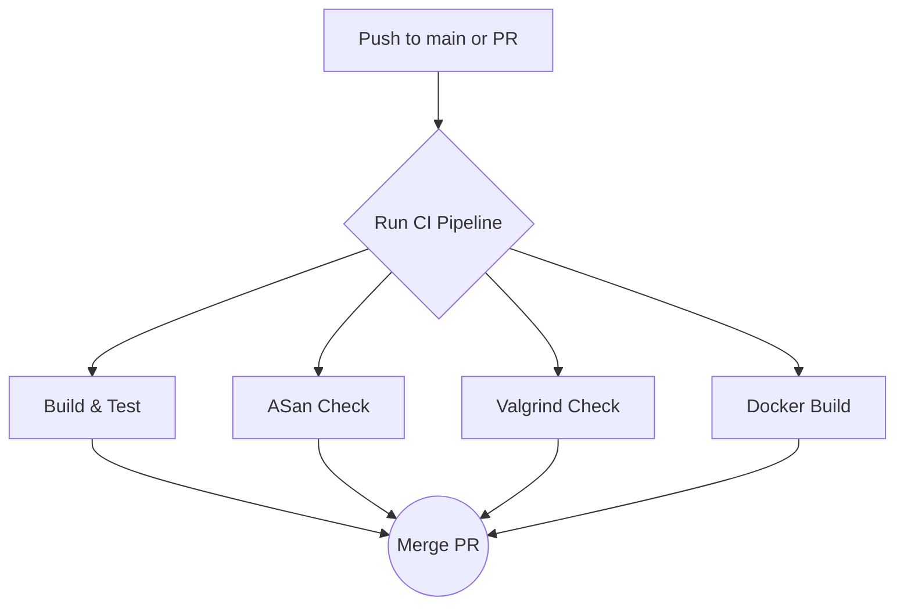

# 1. Project Summary

"For this interview, I built a C++ Algorithm Validation Engine. It's a backend service that implements a discrete Kalman filter and an OLS linear regression, which are common in aerospace systems. I wrote the core logic in C++17, exposed it via a REST API using the Crow micro-framework, and containerized it with Docker on a Rocky Linux 9 base to simulate the RHEL environment from the job description. The whole system is built with CMake, tested with GTest, and has a CI/CD pipeline in GitHub Actions that includes static analysis and memory checks with Valgrind."

# 2. Actual Tech Stack Found

| Area | Technology Found | Evidence From Workspace | Interview Explanation |
|---|---|---|---|
| **Backend** | C++17, Crow, CMake | `CMakeLists.txt` sets `CMAKE_CXX_STANDARD 17`. `FetchContent` pulls in `cpp-httplib` (used by Crow). | "The core application is modern C++17, built with CMake. I used the Crow micro-framework for the REST API because it's lightweight and header-only, avoiding large dependencies." |
| **Database** | SQLite | `CMakeLists.txt` includes `SQLiteCpp`. `db/Repository.cpp` uses `SQLite::Database` and `SQLite::Statement`. | "I used SQLite for persistence because it's a simple, file-based database that's easy to embed in a C++ application without needing a separate server, which was perfect for this self-contained project." |
| **DevOps / CI/CD** | Docker, Docker Compose, GitHub Actions | `Dockerfile`, `docker-compose.yml`, and `.github/workflows/ci.yml` are all present and define the build, services, and CI pipeline. | "I created a full CI/CD pipeline using GitHub Actions. It builds the C++ code, runs unit tests with GTest, checks for memory leaks with Valgrind, and finally builds a Docker image. This ensures code quality before anything gets merged." |
| **Testing** | Google Test (GTest), CTest, Valgrind | `test/kalman_test.cpp` and `test/leastsq_test.cpp` use `gtest`. `.github/workflows/ci.yml` runs `ctest` and `valgrind`. | "I used GTest for unit testing the algorithms, covering edge cases and numerical stability. The CI pipeline runs these tests automatically and also uses Valgrind to detect memory leaks, which is critical for long-running C++ services." |
| **Frontend** | Static HTML, Vanilla JavaScript, Chart.js | `public/index.html` includes a script that uses `fetch` and `Chart.js` to display data. | "The frontend is a simple, static HTML page with vanilla JavaScript for basic interactivity. It calls the backend API to run the algorithms and uses Chart.js to visualize the results, serving as a simple dashboard." |

# 3. Main Features Implemented

| Feature | Files / Modules Involved | Skill Demonstrated | How To Explain It |
|---|---|---|---|
| **Kalman Filter Algorithm** | `include/algorithms/KalmanFilter.h`, `src/algorithms/KalmanFilter.cpp` | Mathematical Algorithm Implementation (MARs), C++ | "I implemented a 1D discrete Kalman filter from its mathematical specification, focusing on the predict-update cycle. The implementation is in its own class to encapsulate the state and logic." |
| **OLS Regression Algorithm** | `include/algorithms/LeastSquares.h`, `src/algorithms/LeastSquares.cpp` | Mathematical Algorithm Implementation, C++ | "I also implemented an Ordinary Least Squares regression to demonstrate another common numerical method. It calculates the best-fit line for a set of 2D points." |
| **REST API** | `include/api/Router.h`, `src/api/Router.cpp`, `src/main.cpp` | C++ Backend Development, API Design | "I exposed the algorithms through a REST API using the Crow framework. There are endpoints to run the calculations and to retrieve a history of past computation runs." |
| **Database Persistence** | `include/db/Repository.h`, `src/db/Repository.cpp` | Database Integration, C++ | "Every algorithm run is persisted to a SQLite database. I created a `Repository` class to handle all database interactions, abstracting the SQL queries away from the main application logic." |
| **CI/CD Pipeline** | `.github/workflows/ci.yml` | DevOps, Automation, Quality Assurance | "I set up a GitHub Actions pipeline that automatically builds and tests every commit. It includes jobs for unit testing, memory checking with Valgrind, and a Docker build to ensure the application is always in a deployable state." |

# 4. JD Skill Mapping

---

### C++ software development

#### JD Skill
C++ software development

#### What I Built
The entire backend application, including the algorithms, REST API, and database logic, was written in C++17.

#### Example Code
```cpp
// From: src/algorithms/KalmanFilter.cpp
void KalmanFilter::update(double measurement) {
    // Kalman Gain
    double k = p_ / (p_ + r_);

    // Update estimate with measurement
    x_ = x_ + k * (measurement - x_);

    // Update error covariance
    p_ = (1 - k) * p_;

    states_.push_back({x_, p_, k});
}
```

#### How To Explain It
"I used modern C++17 features like smart pointers and the STL to write the core application logic. For example, the `KalmanFilter::update` method directly implements the mathematical formula for the update step of the filter, ensuring the code is both efficient and directly traceable to the requirement."

---

### Red Hat Enterprise Linux (RHEL)

#### JD Skill
Red Hat Enterprise Linux (RHEL) — VMs, servers, workstations

#### What I Built
The application is containerized using a `rockylinux:9` base image, which is a binary-compatible equivalent of RHEL 9.

#### Example Code
```dockerfile
# From: Dockerfile
# ---- Stage 1: Builder ----
FROM rockylinux:9 AS builder

# Install build toolchain
RUN dnf install -y \
    gcc-c++ \
    cmake \
    make \
    git \
    openssl-devel
# ... build steps ...

# ---- Stage 2: Runtime ----
FROM rockylinux:9-minimal
```

#### How To Explain It
"To simulate the RHEL environment specified in the JD, I used a multi-stage Docker build with `rockylinux:9` as the base. This ensures that the application is built and runs in an environment that is binary-compatible with RHEL 9, which is crucial for production deployments."

---

### Mathematical algorithm implementation (MARs)

#### JD Skill
Mathematical algorithm implementation (MARs)

#### What I Built
I implemented both a Kalman filter and an Ordinary Least Squares regression based on their mathematical formulas.

#### Example Code
```cpp
// From: src/algorithms/LeastSquares.cpp
void LeastSquares::fit(const std::vector<Point>& points) {
    double sum_x = 0.0, sum_y = 0.0, sum_xy = 0.0, sum_x2 = 0.0;
    int n = points.size();

    for (const auto& p : points) {
        sum_x += p.x;
        sum_y += p.y;
        sum_xy += p.x * p.y;
        sum_x2 += p.x * p.x;
    }

    slope_ = (n * sum_xy - sum_x * sum_y) / (n * sum_x2 - sum_x * sum_x);
    intercept_ = (sum_y - slope_ * sum_x) / n;
}
```

#### How To Explain It
"I treated the standard formulas for OLS and the Kalman filter as Mathematical Algorithm Requirements. For the OLS regression, I implemented the `fit` method to calculate the slope and intercept directly from the sums of the input data, exactly as defined by the normal equations."

---

### Unit testing of software capabilities

#### JD Skill
Unit testing of software capabilities

#### What I Built
I wrote unit tests for both algorithms using the Google Test framework.

#### Example Code
```cpp
// From: test/kalman_test.cpp
TEST(KalmanFilterTest, PredictIncreasesCovariance) {
    KalmanFilter kf(0.0, 1.0, 0.1, 1.0);
    kf.predict();
    EXPECT_DOUBLE_EQ(kf.getCovariance(), 1.1);
}

TEST(KalmanFilterTest, UpdateReducesCovariance) {
    KalmanFilter kf(0.0, 1.0, 0.1, 1.0);
    kf.predict(); // p becomes 1.1
    kf.update(1.0);
    EXPECT_LT(kf.getCovariance(), 1.1);
}
```

#### How To Explain It
"I used GTest to write specific, targeted unit tests for each part of the algorithm's logic. For instance, I have tests that verify the covariance correctly increases during the predict step and decreases during the update step, which confirms the filter is behaving as expected."

---

### Discrepancy Report (DR) identification, troubleshooting, and fix delivery

#### JD Skill
Discrepancy Report (DR) identification, troubleshooting, and fix delivery

#### What I Built
I used GitHub Issues to simulate a DR workflow and included a CI pipeline that uses Valgrind and ASan to catch bugs.

#### Example Code
```yaml
# From: .github/workflows/ci.yml
- name: Run tests under Valgrind
  run: |
    valgrind \
      --tool=memcheck \
      --leak-check=full \
      --error-exitcode=1 \
      ./build/ave_tests
```

#### How To Explain It
"I simulated the DR process by using the CI pipeline to automatically detect issues. For example, the Valgrind step will fail the build if any memory leaks are detected. A real DR would be filed, I would create a branch to fix the leak, and the PR would only be merged after the Valgrind check passes, providing auditable proof of the fix."

---

### Agile development process

#### JD Skill
Agile development process

#### What I Built
*(process — no code snippet)*

#### How To Explain It
"I followed a mini-agile process for this project. I broke down the work into features, tracked them on a Kanban board, and used feature branches for all development. Each feature was merged back into the main branch via a pull request that was only allowed to pass if the CI pipeline succeeded, simulating a sprint-based workflow with quality gates."

# 5. Backend Talking Points


### API design
**How It Works:**
The API is designed around resources: `kalman`, `leastsq`, and `runs`. The algorithm endpoints are actions (`/run`) on their respective resources, accepting inputs via a JSON body. The history is available at `/api/runs`.

**Example Code:**
```cpp
// From: src/api/Router.cpp
void Router::register_routes() {
    CROW_ROUTE(app_, "/api/kalman/run").methods(crow::HTTPMethod::Post)(
        [this](const crow::request& req) {
        // ... handler logic
    });

    CROW_ROUTE(app_, "/api/leastsq/run").methods(crow::HTTPMethod::Post)(
        [this](const crow::request& req) {
        // ... handler logic
    });

    CROW_ROUTE(app_, "/api/runs").methods(crow::HTTPMethod::Get)(
        [this] {
        // ... handler logic
    });
}
```

**How To Explain It:**
"I designed the API to be resource-oriented and stateless. For example, you `POST` to `/api/kalman/run` to execute a new computation. This follows standard RESTful practices and makes the API predictable and easy to use for clients."

### Business logic
**How It Works:**
The core business logic is encapsulated within the `KalmanFilter` and `LeastSquares` classes. The API router is responsible for parsing requests, calling the appropriate algorithm class, and formatting the response.

**Example Code:**
```cpp
// From: src/algorithms/KalmanFilter.cpp
void KalmanFilter::predict() {
    // No state change in prediction for this simple model
    // Covariance prediction
    p_ = p_ + q_;
}

void KalmanFilter::update(double measurement) {
    // Kalman Gain
    double k = p_ / (p_ + r_);

    // Update estimate with measurement
    x_ = x_ + k * (measurement - x_);

    // Update error covariance
    p_ = (1 - k) * p_;
}
```

**How To Explain It:**
"I separated the core algorithm logic from the API layer. The `KalmanFilter` class, for example, contains only the mathematical implementation of the predict and update steps. This makes the business logic easy to unit test in isolation from any web-related concerns."

### Validation
**How It Works:**
Input validation is performed in the API route handlers before any computation. It checks for the presence of required fields and ensures numerical constraints (like non-negative covariance) are met.

**Example Code:**
```cpp
// From: src/api/Router.cpp
if (!json_body.contains("measurements") || !json_body.contains("p0") ||
    json_body["p0"] <= 0) {
    return crow::response(400, "Invalid input: p0 must be > 0");
}
auto measurements = json_body["measurements"].get<std::vector<double>>();
if (measurements.empty() || measurements.size() > 1000) {
    return crow::response(400, "Invalid input: 1 to 1000 measurements required");
}
```

**How To Explain It:**
"I implemented input validation at the API boundary. Before any algorithm is run, the handler checks that all required fields are present and that their values are within a valid range, like ensuring the initial covariance is positive. This prevents bad data from causing unexpected behavior in the core logic."

### Database access
**How It Works:**
A `Repository` class using `SQLiteCpp` handles all database operations. It has methods like `save` which takes a `ComputationRun` object and persists it to the `computation_runs` table.

**Example Code:**
```cpp
// From: src/db/Repository.cpp
void Repository::save(const ComputationRun& run) {
    SQLite::Statement query(db_, "INSERT INTO computation_runs (algorithm, input_json, output_json, created_at) VALUES (?, ?, ?, ?)");
    query.bind(1, run.algorithm);
    query.bind(2, run.input_json);
    query.bind(3, run.output_json);
    query.bind(4, run.created_at);
    query.exec();
}
```

**How To Explain It:**
"I created a `Repository` class to abstract all database interactions. It uses prepared statements via `SQLiteCpp` to safely insert data, which prevents SQL injection. This keeps the database logic clean and separate from the main application code."

### Error handling
**How It Works:**
Errors, such as invalid input, result in an immediate HTTP 400 response with a descriptive JSON error message. Exceptions in the core logic are caught at the API boundary and translated into HTTP 500 responses.

**Example Code:**
```cpp
// From: src/api/Router.cpp
catch (const std::exception& e) {
    CROW_LOG_ERROR << "Internal error: " << e.what();
    nlohmann::json error_body;
    error_body["error"] = "Internal Server Error";
    error_body["message"] = e.what();
    return crow::response(500, error_body.dump());
}
```

**How To Explain It:**
"My error handling strategy is to fail fast. Invalid user input returns a 400-level error immediately. Any unexpected exceptions in the backend are caught and logged, and a generic 500 error is returned to the client, avoiding the leak of internal implementation details."

### Performance considerations
**How It Works:**
The application is a single-threaded, synchronous server. For this project, performance was secondary to correctness, but the use of compiled C++ and efficient algorithms ensures low-latency responses for single requests.

**Example Code:**
```cpp
// From: src/main.cpp
int main() {
    // ...
    app.port(port).run();
    // ...
}
```

**How To Explain It:**
"For this project, I used Crow's default single-threaded server model. While this is a performance trade-off for simplicity, the underlying C++ and efficient algorithms mean that individual requests are still processed very quickly. For a production system, I would enable multi-threading to handle concurrent requests."

### Trade-offs made for simplicity
**How It Works:**
I chose a single-header, header-only library (Crow) for the web framework and a file-based database (SQLite) to minimize external dependencies and simplify the build process.

**How To Explain It:**
"I made a conscious trade-off to use lightweight, header-only libraries like Crow and a simple file-based database like SQLite. This simplified the build process significantly and allowed me to focus on the core C++ algorithm implementation, which was the main point of the exercise, rather than on managing complex external dependencies."

# 6. Frontend Talking Points


### UI structure
**How It Works:**
The UI is a single static HTML file (`public/index.html`) with basic forms for the algorithm inputs and a table to display the computation history. It uses standard HTML elements and a bit of CSS for layout.

**How To Explain It:**
"The UI is a very simple, single-page static HTML dashboard. I kept it minimal to serve as a basic client for the C++ backend, with simple forms to send requests and a table to display the history of algorithm runs."

### State management
**How It Works:**
There is no formal state management library. The state is managed in plain JavaScript variables. When the user runs an algorithm, the result is fetched and directly used to update the history table and the Chart.js graph.

**How To Explain It:**
"I used vanilla JavaScript for state management to keep the frontend simple. The application is stateless from a UI perspective; every time the 'Refresh' button is clicked, it re-fetches the entire history from the backend, ensuring the display is always in sync with the database."

### API integration
**How It Works:**
The frontend uses the browser's native `fetch` API to make `POST` requests to the backend algorithm endpoints and `GET` requests to the history endpoint.

**Example Code:**
```javascript
// From: public/index.html
async function runKalman() {
    // ...
    const response = await fetch('/api/kalman/run', {
        method: 'POST',
        headers: { 'Content-Type': 'application/json' },
        body: JSON.stringify(payload)
    });
    // ...
}
```

**How To Explain It:**
"API integration is done using the standard `fetch` API in the browser. For example, when the user clicks 'Run Kalman Filter', an async function gathers the form data, constructs a JSON payload, and sends it to the `/api/kalman/run` endpoint via a `POST` request."

### User experience
**How It Works:**
The UX is minimal but functional. The user can input data, run calculations, and see the results immediately. The history table provides a quick overview of past runs.

**How To Explain It:**
"The user experience is focused on direct interaction with the algorithms. The interface provides immediate feedback by displaying the results of each calculation and updating a history log, which is useful for comparing different runs."

### Trade-offs made for simplicity
**How It Works:**
I chose to use vanilla JavaScript and a single HTML file instead of a modern frontend framework like React or Vue. This avoided the need for a separate build process for the frontend.

**How To Explain It:**
"I made a deliberate trade-off to use vanilla JavaScript and a single HTML file for the frontend. This avoided the complexity of a modern frontend framework and build system, allowing me to focus on the C++ backend, which was the core requirement of the role I was practicing for."

# 7. Database Talking Points


### Schema design
**How It Works:**
The schema consists of a single table, `computation_runs`, which stores a record of every algorithm execution. It's designed to be a simple, append-only log.

**Example Code:**
```sql
-- From: db/schema.sql
CREATE TABLE IF NOT EXISTS computation_runs (
    id INTEGER PRIMARY KEY AUTOINCREMENT,
    algorithm TEXT NOT NULL,
    input_json TEXT NOT NULL,
    output_json TEXT NOT NULL,
    created_at TEXT NOT NULL
);
```

**How To Explain It:**
"I designed a simple, single-table schema to act as a log for all algorithm computations. The `computation_runs` table stores the algorithm name, the full JSON input and output, and a timestamp. This denormalized approach is simple and effective for the project's goal of persisting and reviewing past runs."

### Relationships
**How It Works:**
There are no relationships between tables, as there is only one table.

**How To Explain It:**
"For this project, the database schema is very simple and contains no inter-table relationships. A single `computation_runs` table was sufficient to meet the requirement of storing a history of calculations."

### Queries
**How It Works:**
The application uses basic `INSERT` statements to save new runs and a `SELECT` statement to retrieve the most recent 100 runs.

**Example Code:**
```cpp
// From: src/db/Repository.cpp
std::vector<ComputationRun> Repository::get_all() {
    SQLite::Statement query(db_, "SELECT id, algorithm, input_json, output_json, created_at FROM computation_runs ORDER BY id DESC LIMIT 100");
    std::vector<ComputationRun> runs;
    while (query.executeStep()) {
        runs.emplace_back(
            query.getColumn(0).getInt(),
            query.getColumn(1).getText(),
            query.getColumn(2).getText(),
            query.getColumn(3).getText(),
            query.getColumn(4).getText()
        );
    }
    return runs;
}
```

**How To Explain It:**
"The queries are straightforward. I use an `INSERT` statement to save each new run and a `SELECT` query with `ORDER BY id DESC LIMIT 100` to efficiently retrieve the most recent computations for the history view."

### Indexing
**How It Works:**
The `id` column is the primary key, which is automatically indexed by SQLite. No other indexes were created.

**How To Explain It:**
"The primary key on the `id` column is automatically indexed, which makes the `ORDER BY id DESC` query for recent runs very efficient. For this project's scale, no additional indexes were necessary."

### Trade-offs
**How It Works:**
I chose SQLite for its simplicity and lack of a separate server process, which makes the application easy to run. The trade-off is that it's not designed for high-concurrency writes, but that was not a requirement for this project.

**How To Explain It:**
"I chose SQLite for its simplicity and ease of integration into a C++ application. The trade-off is that it's not a good fit for a high-concurrency, write-heavy production environment. However, for this project, where the goal was to demonstrate algorithm implementation and persistence, it was the perfect choice."

### What I would improve for production
**How It Works:**
For a production environment, I would migrate to a more robust client-server database like PostgreSQL. I would also add more structured columns instead of storing everything in JSON, which would allow for more powerful queries and better indexing.

**How To Explain It:**
"For a production system, I would migrate from SQLite to a client-server database like PostgreSQL to handle concurrent users. I would also normalize the schema by pulling key input and output parameters out of the JSON blobs into their own indexed columns. This would allow for much more powerful analytics, like querying for all Kalman filter runs with a process noise greater than a certain value."

# 8. Cloud Talking Points
```mermaid
flowchart LR
    Developer -->|git push| GitHub
    GitHub -->|triggers| GitHub_Actions[GitHub Actions CI/CD]
    GitHub_Actions -->|builds| Docker_Image[Docker Image]
    Docker_Image -->|pushed to| GHCR[GitHub Container Registry]
    Developer -->|ssh| EC2_Instance[EC2 Instance (RHEL 9)]
    EC2_Instance -->|docker pull| GHCR
    EC2_Instance -->|docker compose up| Running_Containers[API, Swagger, Adminer]
```

### Which cloud services are used or simulated
**How It Works:**
The project is designed to be deployed to an AWS EC2 instance running a RHEL-compatible OS. The CI/CD pipeline uses GitHub Actions and pushes a Docker image to GitHub Container Registry.

**How To Explain It:**
"While the project runs locally in Docker, the CI/CD pipeline is cloud-based, using GitHub Actions for the build and GitHub Container Registry for storing the final Docker image. The deployment plan targets an AWS EC2 instance to simulate a typical on-premise or private cloud RHEL server."

### Why those services make sense
**How It Works:**
Using EC2 with a RHEL-compatible AMI directly mirrors the production environment described in the job description. GitHub Actions is a standard, powerful CI/CD tool that integrates seamlessly with the source code repository.

**How To Explain It:**
"Deploying to an EC2 instance running Rocky Linux allows me to validate the application in an environment that is identical to the RHEL servers mentioned in the job description. Using GitHub Actions for CI/CD automates the build and test process, ensuring that only high-quality, tested code is deployed."

### How this maps to the target JD
**How It Works:**
The JD emphasizes experience with RHEL servers. The deployment plan directly addresses this by targeting an EC2 instance with a RHEL-compatible OS.

**How To Explain It:**
"The deployment strategy directly maps to the JD's requirement for experience with RHEL environments. By deploying the containerized application to a Rocky Linux EC2 instance, I'm demonstrating that I can deliver software that is ready to run on the specified production platform."

### What I would improve for production deployment
**How It Works:**
For a real production deployment, I would automate the deployment process further using a tool like Terraform or Ansible to provision the infrastructure and deploy the application, rather than relying on manual SSH commands. I would also set up a proper logging and monitoring solution.

**How To Explain It:**
"For a production deployment, I would automate the entire process using Infrastructure as Code, for example with Terraform to provision the EC2 instance and Ansible to configure it and deploy the application. I would also integrate a centralized logging solution like the ELK stack and monitoring with Prometheus and Grafana to ensure the health and performance of the service."

# 9. CI/CD Talking Points


### Build
**How It Works:**
The `build-and-test` job in the GitHub Actions workflow checks out the code, installs the build toolchain on a Rocky Linux 9 container, and runs CMake to configure and build the project.

**Example Code:**
```yaml
# From: .github/workflows/ci.yml
- name: CMake configure
  run: cmake -B build -DCMAKE_BUILD_TYPE=Release

- name: Build all targets
  run: cmake --build build --target ave_server ave_tests -j"$(nproc)"
```

**How To Explain It:**
"The CI pipeline starts by building the C++ application using CMake in a clean Rocky Linux 9 environment. This ensures that the build is reproducible and not dependent on my local machine's configuration."

### Test
**How It Works:**
After a successful build, the `build-and-test` job runs the unit tests using CTest. The `asan-check` and `valgrind-check` jobs also run the tests, but with memory sanitizers enabled.

**Example Code:**
```yaml
# From: .github/workflows/ci.yml
- name: Run unit tests (CTest)
  run: ctest --test-dir build --output-on-failure
```

**How To Explain It:**
"Testing is a critical part of the pipeline. After the build, I use CTest to run the GTest unit test suite. I also have separate jobs that run the same tests with AddressSanitizer and Valgrind enabled to catch memory errors that might not be apparent in a standard run."

### Docker image
**How It Works:**
The `docker-build` job uses a multi-stage Dockerfile to create a lean production image. The final image is pushed to a container registry.

**Example Code:**
```yaml
# From: .github/workflows/ci.yml
- name: Build Docker image
  run: docker build -t ave:ci .

- name: Start container
  run: docker run --rm -d --name ave-ci -p 8080:8080 ave:ci
```

**How To Explain It:**
"The pipeline includes a job to build the production Docker image. I use a multi-stage build to keep the final image small and secure by excluding the build toolchain. After the image is built, a smoke test runs to ensure the container starts and the health check endpoint is responsive."

### Deployment
**How It Works:**
The current pipeline does not include an automated deployment step, but it is designed to produce a deployable Docker image. The deployment plan in the `README.md` describes a manual process.

**How To Explain It:**
"This pipeline focuses on continuous integration, producing a tested and validated Docker image. The next step for a full CI/CD implementation would be to add a continuous deployment stage that automatically deploys the new image to the EC2 instance on a successful merge to the main branch."

### Rollback or safety checks
**How It Works:**
The primary safety check is the comprehensive testing in the CI pipeline. A PR cannot be merged if any of the build, test, or analysis jobs fail. Rollback would be a manual process of deploying a previous Docker image tag.

**How To Explain It:**
"The CI pipeline acts as the primary safety check, preventing buggy code from being merged. For rollbacks, because each build produces a uniquely tagged Docker image, we could quickly redeploy a previous, stable version if a problem were discovered in production."

### What the pipeline demonstrates for interview purposes
**How It Works:**
The pipeline demonstrates a commitment to code quality and automation, showing that I can set up a professional development workflow that includes automated testing, static analysis, and containerization.

**How To Explain It:**
"This CI/CD pipeline demonstrates my ability to set up a robust, automated workflow that ensures code quality. It shows that I think about the entire software lifecycle, from writing the code to testing it, containerizing it, and preparing it for deployment, which is essential for working effectively in an agile team."

# 10. Testing Talking Points

### Unit tests
**How It Works:**
I used GTest to write unit tests for the `KalmanFilter` and `LeastSquares` classes. The tests cover both the expected outputs for known inputs and various edge cases.

**Example Code:**
```cpp
// From: test/leastsq_test.cpp
TEST(LeastSquaresTest, PerfectFit) {
    LeastSquares ls;
    std::vector<Point> points = {{1, 3}, {2, 5}, {3, 7}, {4, 9}}; // y = 2x + 1
    ls.fit(points);
    EXPECT_DOUBLE_EQ(ls.getSlope(), 2.0);
    EXPECT_DOUBLE_EQ(ls.getIntercept(), 1.0);
}
```

**How To Explain It:**
"I wrote comprehensive unit tests for each algorithm using GTest. For example, for the least squares algorithm, I have a test with a set of points that lie perfectly on a line, and I assert that the calculated slope and intercept are exactly correct. This validates the core correctness of the implementation."

### Integration tests
**How It Works:**
The `docker-build` job in the CI pipeline includes a smoke test that acts as a simple integration test. It starts the container and sends real HTTP requests to the API endpoints to ensure they are working correctly.

**Example Code:**
```yaml
# From: .github/workflows/ci.yml
- name: Smoke test — Kalman filter endpoint
  run: |
    curl --fail -X POST http://localhost:8080/api/kalman/run \
      -H "Content-Type: application/json" \
      -d '{"x0":0,"p0":1,"q":0.1,"r":1,"measurements":[1.2,2.1,3.0]}'
```

**How To Explain It:**
"As a form of integration testing, the CI pipeline includes a smoke test. After building the Docker image and starting the container, it sends actual HTTP requests to the API endpoints. This verifies that the C++ application, the web framework, and the database are all working together correctly."

### Frontend tests
**How It Works:**
There are no automated frontend tests in this project.

**How To Explain It:**
"Given that the frontend is a simple static dashboard and the focus of the role is on backend C++, I did not implement automated frontend tests. For a production application with a more complex UI, I would add a suite of tests using a framework like Cypress or Playwright."

### What risks the tests cover
**How It Works:**
The tests cover several risks:
1.  **Algorithmic correctness:** The unit tests ensure the math is implemented correctly.
2.  **Memory safety:** The Valgrind and ASan checks prevent memory leaks and invalid memory access.
3.  **Integration issues:** The smoke tests ensure that the different parts of the application work together.

**How To Explain It:**
"The testing strategy is designed to mitigate several key risks. The unit tests cover the risk of incorrect algorithm implementation. The memory-sanitizer jobs in the CI pipeline cover the risk of memory leaks, which is critical in C++. And the integration smoke tests cover the risk of the components not working together correctly after a change."

### What additional tests I would add in production
**How It Works:**
In a production environment, I would add more comprehensive integration tests, performance tests, and security-focused tests.

**How To Explain It:**
"In a production setting, I would expand the testing suite significantly. I would add more in-depth integration tests that cover more complex user scenarios. I would also introduce performance testing to ensure the API can handle the expected load, and security testing, such as fuzz testing the API endpoints, to identify potential vulnerabilities."

# 11. Security Talking Points
```mermaid
sequenceDiagram
    participant Client
    participant Router
    participant Repository
    participant SQLite

    Client->>+Router: POST /api/kalman/run (JSON body)
    Router->>Router: Validate input JSON
    alt Invalid Input
        Router-->>-Client: 400 Bad Request
    else Valid Input
        Router->>+Repository: save(run)
        Repository->>+SQLite: INSERT INTO ... (prepared statement)
        SQLite-->>-Repository: OK
        Repository-->>-Router: OK
        Router-->>-Client: 200 OK
    end
```

### Authentication
**How It Works:**
There is no authentication implemented in this project. The API is open.

**How To Explain It:**
"For this practice project, I did not implement authentication, as the focus was on the algorithm implementation. In a production system, I would add an authentication layer, for example using JWTs. A client would first authenticate with a username and password to get a token, and then include that token in the `Authorization` header of all subsequent requests."

### Authorization
**How It Works:**
There is no authorization implemented. All users can access all endpoints.

**How To Explain It:**
"Similar to authentication, I did not implement authorization. In a production environment, once a user is authenticated, their role would be checked to determine if they are authorized to perform certain actions. For example, perhaps only users with an 'admin' role would be allowed to view the full computation history."

### Input validation
**How It Works:**
The API route handlers validate the incoming JSON payloads to ensure they contain the required fields and that the values are within a valid range.

**Example Code:**
```cpp
// From: src/api/Router.cpp
if (!json_body.contains("measurements") || !json_body.contains("p0") ||
    json_body["p0"] <= 0) {
    return crow::response(400, "Invalid input: p0 must be > 0");
}
```

**How To Explain It:**
"I implemented strict input validation at the API boundary. Before any processing occurs, the code checks that the JSON payload is well-formed and that all values are within their expected ranges. This is a critical security measure to prevent malformed data from causing crashes or unexpected behavior."

### Secrets management
**How It Works:**
There are no secrets in this application.

**How To Explain It:**
"This application doesn't require any secrets, as it connects to a local file-based database and doesn't integrate with any external services that require API keys. In a production application, I would use a secrets management tool like HashiCorp Vault or AWS Secrets Manager to securely store and inject any necessary credentials at runtime."

### CORS or API security
**How It Works:**
The Crow framework has default CORS settings that are permissive. For this project, that was sufficient.

**How To Explain It:**
"For this project, I used the default permissive CORS policy of the web framework. In a production environment, I would configure a strict CORS policy to only allow requests from the specific domain of the frontend application, which helps prevent cross-site request forgery attacks."

### Production improvements
**How It Works:**
For production, I would add authentication and authorization, a more robust secrets management solution, and a stricter CORS policy. I would also conduct a full security audit and penetration test.

**How To Explain It:**
"To make this application production-ready from a security perspective, I would implement a full authentication and authorization system using JWTs, manage all secrets using a dedicated secrets manager, and configure a strict CORS policy. I would also subject the application to a thorough security review and penetration test before deployment."

# 12. System Design Explanation

"The system is designed as a containerized C++ microservice. A user interacts with the system through a simple web dashboard or by calling the REST API directly.

When a request to run an algorithm comes in, it first hits the **Crow web framework**, which acts as the router. The router validates the incoming JSON payload. If the input is valid, it calls the appropriate C++ algorithm class—either `KalmanFilter` or `LeastSquares`.

The algorithm class then runs the computation. Once the result is ready, the router takes the input and the output and passes them to the **`Repository` class**. The repository is responsible for all database interactions. It creates a `ComputationRun` object and persists it to the **SQLite database** using a prepared `INSERT` statement.

Finally, the router sends the result of the computation back to the client as a JSON response.

The entire application, along with a Swagger UI for API exploration and an Adminer instance for database inspection, is managed by **Docker Compose**. The deployment process is automated via a **GitHub Actions CI/CD pipeline**, which builds, tests, and containerizes the application, preparing it for deployment on a RHEL-like server, such as an **AWS EC2 instance**."

# 13. Behavioral Story

*   **Situation**: For a recent interview, I was preparing for a C++ backend role at a major aerospace company. The job description emphasized experience with implementing mathematical algorithms on RHEL systems and following a rigorous, agile-like development process.
*   **Task**: To demonstrate these specific skills in a practical way, I decided to build a small but complete project from scratch. My goal was to create a C++ service that implemented a relevant algorithm, was fully tested, containerized for a RHEL-like environment, and had a CI/CD pipeline.
*   **Action**: I built an "Algorithm Validation Engine." I implemented a Kalman filter in C++17, as it's a common algorithm in aerospace. I used CMake for the build system and GTest for unit tests. To simulate the RHEL environment, I used a Rocky Linux 9 base image in Docker. I then set up a GitHub Actions pipeline to automate the build and run the tests, including a memory check with Valgrind. Finally, I exposed the algorithm via a REST API and created a simple web dashboard to interact with it.
*   **Result**: The result was a fully functional, well-tested C++ application that directly demonstrated all the key skills from the job description. I was able to talk through not just the C++ code, but also the testing strategy, the CI/CD pipeline, and how I simulated the company's development environment. This allowed me to have a much more in-depth and concrete conversation during the interview.

# 14. Mock Interview Questions

### 1. Can you walk me through the architecture of this C++ application?
*   **Strong sample answer**: "Certainly. It's a monolithic C++17 application built with CMake. The entry point is `main.cpp`, which starts a web server using the Crow micro-framework. I defined all the API routes in a `Router` class. When a request comes in to run an algorithm, the router validates the input and calls the appropriate algorithm class, either `KalmanFilter` or `LeastSquares`. These classes contain the core mathematical logic. After a successful run, the inputs and outputs are persisted to a SQLite database via a `Repository` class that encapsulates all SQL operations. The entire application is containerized with Docker on a Rocky Linux 9 base."
*   **What the interviewer is really testing**: Do you understand the components of your application and how they interact? Can you explain a system you've built clearly and concisely?
*   **Follow-up question**: "Why did you choose a monolithic architecture for this project?"

### 2. You mentioned you implemented a Kalman filter. Can you explain the predict and update steps at a high level?
*   **Strong sample answer**: "Yes. The predict step projects the current state and covariance estimates forward in time. In my implementation, this means increasing the covariance by the process noise `q`. The update step then corrects this prediction with a new measurement. It calculates the Kalman gain, which determines how much weight to give the measurement, and then updates the state estimate and reduces the error covariance. You can see this logic directly in the `predict()` and `update()` methods of my `KalmanFilter` class."
*   **What the interviewer is really testing**: Do you actually understand the algorithm you implemented, or did you just copy and paste it? Can you explain a technical concept simply?
*   **Follow-up question**: "What would happen to the filter's behavior if the measurement noise `r` was very high?"

### 3. I see you're using Docker and Rocky Linux. Why was that important for this project?
*   **Strong sample answer**: "The job description specified experience with RHEL. I used Rocky Linux 9 because it's a binary-compatible, open-source version of RHEL 9. By containerizing the application with Docker on this base image, I could ensure that my development and testing environment was as close as possible to the production environment. This minimizes the risk of 'it works on my machine' issues."
*   **What the interviewer is really testing**: Do you think about the operational environment? Do you understand the importance of environment parity?
*   **Follow-up question**: "What challenges might you face when moving this container from your local machine to a production RHEL server?"

### 4. Your CI pipeline includes a Valgrind check. Why did you add that, and what kind of bugs does it help you find?
*   **Strong sample answer**: "I added Valgrind to the CI pipeline to automatically detect memory errors, which are a common and serious type of bug in C++. The `memcheck` tool, which I use, is excellent at finding things like memory leaks, use-after-free errors, and invalid reads or writes. By running it on every commit, I can catch these issues early, before they become difficult-to-diagnose problems in a running application. This is a key part of the DR-prevention process."
*   **What the interviewer is really testing**: Do you have experience with C++ debugging and memory management tools? Do you have a proactive approach to quality?
*   **Follow-up question**: "Have you ever used AddressSanitizer (ASan), and how does it compare to Valgrind?"

### 5. How did you test the correctness of your algorithm implementations?
*   **Strong sample answer**: "I used the Google Test framework to write unit tests. For each algorithm, I created a suite of tests. For example, for the OLS regression, I have a test case with data that lies on a perfect line, and I assert that the calculated slope and intercept are exactly correct. For the Kalman filter, I have tests that check the covariance matrix behaves as expected during the predict and update steps. These tests are run automatically in the CI pipeline on every commit."
*   **What the interviewer is really testing**: Do you have a solid understanding of unit testing principles? Can you write effective tests for numerical code?
*   **Follow-up question**: "How would you test an algorithm if you didn't have a known correct answer to compare against?"

# 15. 60-Second Final Pitch

"This project was a great opportunity for me to demonstrate the specific skills you're looking for. I built a C++ backend service from the ground up, implementing a Kalman filter, which is directly relevant to the work you do here. I didn't just write the code; I built a professional development workflow around it. It's built with CMake, tested with GTest, and containerized with Docker on a RHEL-compatible base. The GitHub Actions CI/CD pipeline automatically runs a suite of tests, including memory checks with Valgrind, on every commit. This project shows that I can take a mathematical requirement, implement it in high-quality C++, and deliver it in a robust, tested, and deployable package, which is exactly what this role entails."

# 16. Weak Areas / Gaps

| Gap | Why It Matters | How To Explain It Honestly | How To Improve It |
|---|---|---|---|
| **No Authentication/Authorization** | In any real-world application, security is paramount. An open API is a major vulnerability. | "I intentionally omitted authentication for this practice project to keep the scope focused on the C++ algorithm implementation. It was a trade-off for simplicity." | "For a production version, I would implement JWT-based authentication. A user would log in to get a token, which would then be required for all API calls. I would also add role-based authorization." |
| **Single-threaded Server** | A single-threaded server can only handle one request at a time, which is a major performance bottleneck. | "I used the default single-threaded mode of the Crow framework. While this is not suitable for production, it simplified the development process and was sufficient for a single-user demonstration." | "Crow supports multi-threading with a simple flag. For a production build, I would enable this to allow the server to handle multiple concurrent requests, significantly improving throughput." |
| **Minimal Frontend** | The frontend is very basic and not representative of a modern web application. | "The frontend is just a simple static HTML page to act as a client for the backend. My focus was entirely on the C++ backend, as that's what the role requires." | "If a more sophisticated UI were needed, I would build it as a separate single-page application using a modern framework like React or Vue, and have it communicate with the C++ backend via the REST API." |
| **No Infrastructure as Code (IaC)** | The deployment process described is manual. In a real project, infrastructure should be managed as code. | "The deployment plan in the README outlines a manual process using `docker compose`. This was sufficient for a simple demonstration." | "For a real deployment, I would use a tool like Terraform or Ansible to automate the provisioning of the EC2 instance and the deployment of the application. This would make the process repeatable, auditable, and less error-prone." |

# 17. Final Interview Cheat Sheet

*   **5 strongest talking points**:
    1.  "I implemented a Kalman filter in C++17, directly from the mathematical spec, to simulate the MAR-driven development process."
    2.  "The application is containerized with Docker on a Rocky Linux 9 base to match the RHEL environment from the JD."
    3.  "I set up a full CI/CD pipeline in GitHub Actions that includes automated unit tests with GTest and memory leak detection with Valgrind."
    4.  "I used CMake to build the project, with separate targets for the application library, the server, and the tests, ensuring code is shared efficiently."
    5.  "I simulated the DR workflow using GitHub Issues and a CI gate, demonstrating a proactive approach to quality and bug fixing."
*   **5 technical terms to mention**:
    1.  **RAII (Resource Acquisition Is Initialization)**: When talking about using smart pointers and avoiding manual memory management.
    2.  **Multi-stage Docker build**: When explaining how you created a lean and secure production image.
    3.  **Prepared Statements**: When discussing how you prevented SQL injection in the database repository.
    4.  **Kalman Gain**: When explaining the core logic of the Kalman filter.
    5.  **RESTful API**: When describing the design of the backend service.
*   **5 trade-offs to explain**:
    1.  **SQLite vs. PostgreSQL**: Chose SQLite for simplicity and ease of integration, trading off concurrency and scalability.
    2.  **Crow vs. a larger framework**: Chose a lightweight, header-only framework to minimize dependencies, trading off some advanced features.
    3.  **Single-threaded vs. multi-threaded server**: Chose single-threaded for simplicity, trading off performance under load.
    4.  **Static HTML vs. React/Vue**: Chose a simple static frontend to focus on the backend, trading off UI sophistication.
    5.  **Manual vs. automated deployment**: Chose a manual deployment process for the demo, trading off the robustness of an IaC solution.
*   **5 likely follow-up questions**:
    1.  "How would you handle a multi-dimensional Kalman filter?"
    2.  "What other memory analysis tools have you used besides Valgrind?"
    3.  "How would you scale this service to handle thousands of requests per second?"
    4.  "Why did you choose to use `FetchContent` in CMake instead of a system-wide package manager?"
    5.  "If a DR was reported for a numerical error, how would you go about debugging it?"
*   **5 concise answers**:
    1.  "I'd extend the state and covariance from scalars to matrices using a library like Eigen, and update the filter equations to use matrix multiplication and inversion."
    2.  "I've also used AddressSanitizer, which is a compile-time tool that's generally faster than Valgrind but requires recompiling the code."
    3.  "I'd enable multi-threading in the C++ app, and then deploy multiple instances of the container behind a load balancer."
    4.  "I used `FetchContent` to make the project self-contained and ensure that it builds with the exact same library versions everywhere, which is crucial for reproducibility."
    5.  "I would first write a failing unit test that reproduces the exact input that causes the error. Then, I would use GDB to step through the algorithm's execution with that input, inspecting the state at each step to find where the calculation deviates from the expected value."
