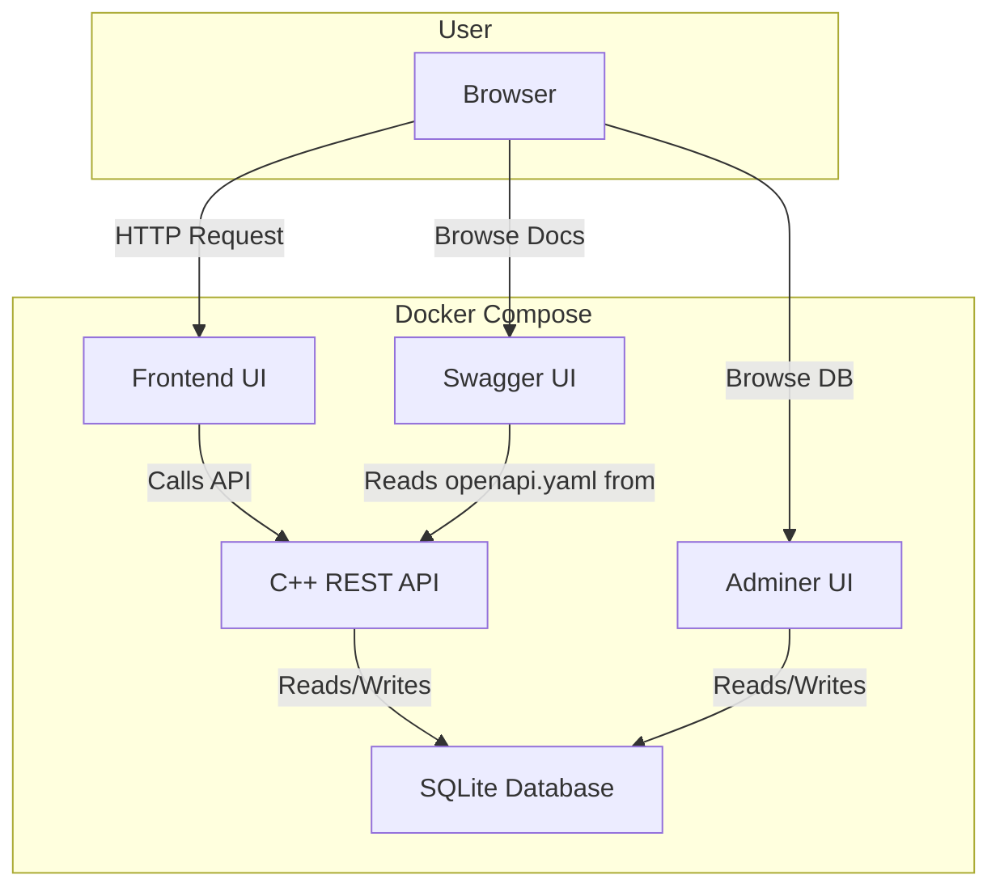

# New Hire Exploration Guide

## 0. What Is This Project?

This project is a C++ backend service that implements two mathematical algorithms: a discrete Kalman filter and an Ordinary Least Squares (OLS) regression. It exposes these algorithms over a REST API and includes a simple web dashboard to visualize the results. The entire system is designed to run inside Docker containers on an environment that mimics Red Hat Enterprise Linux (RHEL), which is common in aerospace and defense industries. It was created as a practical demonstration of C++ development, testing, and DevOps skills.

---

## 1. Quick Start (Everything Up in One Command)

The entire application stack, including the backend, API documentation, and database browser, can be started with a single command.

```bash
# Build and start all services (API + Swagger UI + Adminer)
docker compose up --build
```

Once running, you can access the different parts of the system at these URLs:

**Service Map**

| Service | URL | What You Will See |
|---|---|---|
| Frontend Dashboard | http://localhost:8080/ | A web UI to run the algorithms and see results. |
| Backend API | http://localhost:8080 | The base URL for the C++ REST API. |
| API Docs (Swagger) | http://localhost:8090 | Interactive documentation for all API endpoints. |
| Database Admin | http://localhost:8889 | A web UI to browse the SQLite database. |

---

## 2. Explore the Frontend

The frontend is a simple, single-page dashboard for interacting with the backend algorithms.

- **URL**: [http://localhost:8080/](http://localhost:8080/)
- **Login**: There is no login; the application is open.

**Key Flows to Try:**

1.  **Run the Kalman Filter**: On the left-hand card, keep the default values and click the "Run Kalman Filter" button. You will see a JSON output of the filter's final state and a chart visualizing the filter's estimates against the raw measurements.
2.  **Run OLS Regression**: On the right-hand card, use the default data points and click "Run OLS Regression". You will see the calculated slope, intercept, and R-squared value, along with a chart showing the original data points and the fitted line.
3.  **Check the History**: At the bottom of the page, you will see a "Computation History" table. After running the algorithms, this table will automatically update with a record of each run.

The frontend is a single static file located at `public/index.html`. It is written in vanilla JavaScript and uses the Chart.js library for plotting, demonstrating a minimal client for the C++ backend.

---

## 3. Explore the Backend API

The best way to explore the backend is through the Swagger UI, which provides interactive documentation.

- **URL**: [http://localhost:8090/](http://localhost:8090/)
- **Authentication**: There is no authentication on this API.

**Useful Endpoints to Try (in order):**

1.  **`GET /health`**: Click this endpoint and hit "Execute". You should see a `200 OK` response with `{"status":"ok", ...}`. This confirms the C++ backend is running.
2.  **`GET /api/algorithms`**: Execute this to see a list of the algorithms the API provides.
3.  **`POST /api/kalman/run`**:
    -   **What it does**: Runs the discrete Kalman filter.
    -   **What to send**: Click "Try it out" and use the example JSON body.
    -   **What to look for**: The response will contain the final state estimate and a history of the state at each step of the filter.
4.  **`POST /api/leastsq/run`**:
    -   **What it does**: Runs the OLS linear regression.
    -   **What to send**: Use the example JSON body, which contains an array of `(x, y)` points.
    -   **What to look for**: The response will include the calculated `slope`, `intercept`, and `r_squared` value.
5.  **`GET /api/runs`**:
    -   **What it does**: Retrieves a history of the last 100 algorithm computations.
    -   **What to send**: No body is needed.
    -   **What to look for**: The response will be a JSON array, where each object is a record of a previous run, matching what you see in the frontend's history table.

The C++ source code for these API handlers is located in `src/api/Router.cpp`.

---

## 4. Explore the Database

The application uses a simple SQLite database to store the history of all algorithm runs. You can browse it using Adminer.

- **Admin UI URL**: [http://localhost:8889/](http://localhost:8889/)
- **Login Credentials**:
    -   System: **SQLite**
    -   Database: `/data/ave.db`
    -   Username/Password: (leave blank)

**What to look for:**

-   Once logged in, you will see one table: `computation_runs`.
-   Click on `computation_runs` to see its structure and data. It stores the algorithm name, the full JSON input, the full JSON output, and a timestamp for every run.

**Recommended Query:**

Run this query in the "SQL command" tab to see the 10 most recent runs:

```sql
SELECT
  id,
  algorithm,
  created_at,
  json_extract(input_json, '$.measurements') as kalman_measurements,
  json_extract(output_json, '$.final_state') as kalman_final_state,
  json_extract(output_json, '$.slope') as ols_slope
FROM computation_runs
ORDER BY id DESC
LIMIT 10;
```

-   The database schema is defined automatically by the application, but a reference can be found in `db/schema.sql`.
-   The C++ code that interacts with the database is in `src/db/Repository.cpp`.

---

## 5. Explore the CI/CD Pipeline

The project uses GitHub Actions for Continuous Integration and Continuous Delivery (CI/CD).

-   **Pipeline File**: The entire workflow is defined in `.github/workflows/ci.yml`.
-   **Pipeline Stages**:
    1.  **`build-and-test`**: Compiles the C++ code and runs the unit tests.
    2.  **`asan-check`**: Compiles and tests the code with AddressSanitizer to find memory corruption bugs.
    3.  **`valgrind-check`**: Runs the tests under Valgrind's `memcheck` tool to find memory leaks.
    4.  **`docker-build`**: Builds the final Docker image and runs a smoke test to ensure the container starts and the API is responsive.
-   **How to Read Results**: In the GitHub repository, go to the "Actions" tab. A green checkmark means all jobs passed; a red 'X' means at least one failed. You can click into a run to see the logs for each job.
-   **How to Trigger**: The pipeline runs automatically on any push or pull request to the `main` branch.

---

## 6. Explore Cloud Services

This project does not use any external cloud services like AWS or Azure. It is designed to be self-contained and run locally or on a single server. The deployment plan targets a cloud VM (like an AWS EC2 instance), but it does not use managed cloud services like S3 or Lambda.

---

## 7. Run the Tests

The project has a suite of unit tests for the core algorithms.

| Test Type | Command | What It Tests | Where the Files Are |
|---|---|---|---|
| Unit | `ctest --test-dir build --output-on-failure` | The mathematical correctness of the Kalman filter and OLS regression implementations. | `test/kalman_test.cpp`, `test/leastsq_test.cpp` |
| Memory (Valgrind) | `valgrind --tool=memcheck --leak-check=full --error-exitcode=1 ./build/debug/ave_tests` | Memory leaks and invalid memory access in the C++ code. | (Runs the same test files) |
| Memory (ASan) | `ASAN_OPTIONS=abort_on_error=1 ./build/asan/ave_tests` | Memory corruption, buffer overflows, and use-after-free bugs. | (Runs the same test files) |

**Key Test Files to Read:**

1.  `test/kalman_test.cpp`: The tests `PredictIncreasesCovariance` and `UpdateReducesCovariance` are great examples of testing the fundamental behavior of the Kalman filter.
2.  `test/leastsq_test.cpp`: The `PerfectFit` test validates the OLS algorithm against a known linear equation, ensuring its mathematical correctness.

---

## 8. Understand the Architecture



-   **Frontend UI**: A static HTML/JS dashboard that provides a user interface for the algorithms.
-   **C++ REST API**: The core of the application; implements the algorithms and serves the API and frontend.
-   **Swagger UI**: An API exploration tool that reads the `openapi.yaml` spec from the backend.
-   **Adminer UI**: A database management tool for browsing the SQLite data.
-   **SQLite Database**: A file-based database that persists the history of all algorithm runs.

---

## 9. Key Source Code Tour

| File / Directory | Why It Matters |
|---|---|
| `docker-compose.yml` | Defines all the services (`api`, `swagger-ui`, `adminer`) and how they connect. The entry point to understanding the system's structure. |
| `.github/workflows/ci.yml` | Defines the entire CI/CD pipeline. Shows how the code is tested and built. |
| `CMakeLists.txt` | The main build script for the C++ application. It declares all dependencies and build targets (`ave_server`, `ave_tests`). |
| `src/main.cpp` | The entry point for the C++ application. It initializes the router and starts the web server. |
| `src/api/Router.cpp` | Contains all the API route handlers. This is where HTTP requests are processed and translated into calls to the core logic. |
| `src/algorithms/KalmanFilter.cpp` | The core implementation of the Kalman filter algorithm. This is the primary "business logic". |
| `src/db/Repository.cpp` | Encapsulates all database logic. Shows how the application interacts with the SQLite database. |
| `test/kalman_test.cpp` | A key unit test file. Shows how the Kalman filter's correctness is verified. |
| `public/index.html` | The entire frontend application. Shows how the API is consumed by a client. |
| `openapi.yaml` | The formal contract for the REST API. It defines all endpoints, request bodies, and responses. |

---

## 10. Things to Ask Your Team

1.  What is the process for updating the `openapi.yaml` spec when a new endpoint is added? Is it manual or is there a tool?
2.  The project uses `FetchContent` in CMake to manage dependencies. What is the policy on updating these dependency versions?
3.  Are there any performance requirements for the algorithm endpoints? What is the expected load in production?
4.  The current deployment plan is manual. Is there an existing automated deployment process, or is that something the team is looking to build?
5.  Who is the primary consumer of this API? Is it only the internal frontend, or are there other services that rely on it?
6.  What are the long-term plans for the database? Will it remain SQLite or migrate to a larger client-server database like PostgreSQL?

---

## 11. Day-One Checklist

- [ ] Run `docker compose up --build` and see all services healthy.
- [ ] Open the frontend at [http://localhost:8080/](http://localhost:8080/) and run both algorithms.
- [ ] Open Swagger UI at [http://localhost:8090/](http://localhost:8090/) and call the `GET /api/runs` endpoint.
- [ ] Browse the `computation_runs` table in Adminer at [http://localhost:8889/](http://localhost:8889/).
- [ ] Run the unit tests locally by executing `ctest` inside a build directory.
- [ ] Read the `.github/workflows/ci.yml` pipeline file end-to-end.
- [ ] Read the 3 key source files: `src/main.cpp`, `src/api/Router.cpp`, and `src/algorithms/KalmanFilter.cpp`.
